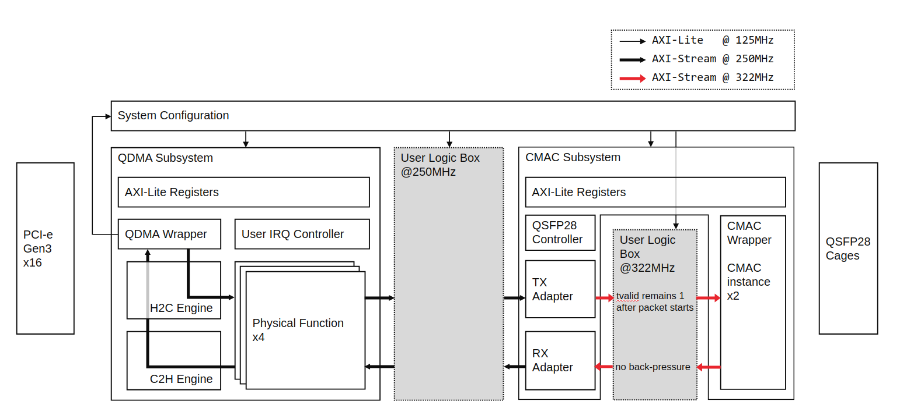

# AMD OpenNIC Project

The OpenNIC project provides an FPGA-based NIC platform for the open source
community.  It consists of two components, a NIC shell and a Linux kernel
driver.  The NIC shell is an RTL project for Xilinx FPGA, and currently targets
two of the Xilinx Alveo board family.  It delivers a NIC implementation
supporting up to four PCI-e physical functions (PFs) and two 100Gbps Ethernet
ports.  The shell is equipped with well-defined data and control interfaces and
is designed to enable easy integration of user logic into the shell.  A block
diagram of the OpenNIC shell follows:

The Linux kernel driver implements the device driver for the NIC shell. It
supports multiple PFs and multiple TX/RX queues in each PF.  The RX queues are
selected through a receive-side scaling (RSS) implementation in the shell.

The goal of OpenNIC is to enable fast prototyping of hardware-accelerated
network-attached applications.  It is not a fully-fledged SmartNIC solution.

The latest version of OpenNIC is 1.0, which uses OpenNIC shell version 1.0 and
OpenNIC driver version 1.0 or OpenNIC DPDK driver version 1.0.

## Repo Structure

This repository serves as the release point for the OpenNIC project, which
consists of three components:
   - [OpenNIC shell](https://github.com/Xilinx/open-nic-shell.git),
   - [OpenNIC driver](https://github.com/Xilinx/open-nic-driver.git), and
   - [OpenNIC DPDK](https://github.com/Xilinx/open-nic-dpdk.git).

A released version of OpenNIC pins to a commit in the `master` branch of each component repository.

A Bash script `script/checkout.sh` is provided to checkout a specific version of
OpenNIC.  It takes two arguments, the root directory for the cloned repositories
and optionally, a version number.  By default, it will checkout the latest
version.  The correspondence between OpenNIC versions and component repository
tags are tracked in `script/version.yaml`.

## Technical Reference Guide

A technical reference guide ([PDF version](https://github.com/Xilinx/open-nic/blob/main/OpenNIC_manual.pdf)
or [MS Word version](https://github.com/Xilinx/open-nic/blob/main/OpenNIC_manual.docx)) provides details of
the design of the OpenNIC.  The document primarily covers the hardware architecture and its related
implementation.  It also briefly describes the organization of the Linux kernel driver for OpenNIC.

## FAQ

A set of [frequently asked questions](https://github.com/Xilinx/open-nic/blob/main/FAQ.md)
has been prepared to help in answering questions regarding this project.  The FAQ has sections for:
(a) general questions, (b) feature set questions, (c) hardware questions, (d) software questions, and
(e) operation questions.  Please contact us to submit any additional questions that you feel would help others.

---

# Copyright Notice and Disclaimer

This file contains confidential and proprietary information of Xilinx, Inc. and
is protected under U.S. and international copyright and other intellectual
property laws.

DISCLAIMER

This disclaimer is not a license and does not grant any rights to the materials
distributed herewith.  Except as otherwise provided in a valid license issued to
you by Xilinx, and to the maximum extent permitted by applicable law: (1) THESE
MATERIALS ARE MADE AVAILABLE "AS IS" AND WITH ALL FAULTS, AND XILINX HEREBY
DISCLAIMS ALL WARRANTIES AND CONDITIONS, EXPRESS, IMPLIED, OR STATUTORY,
INCLUDING BUT NOT LIMITED TO WARRANTIES OF MERCHANTABILITY, NONINFRINGEMENT, OR
FITNESS FOR ANY PARTICULAR PURPOSE; and (2) Xilinx shall not be liable (whether
in contract or tort, including negligence, or under any other theory of
liability) for any loss or damage of any kind or nature related to, arising
under or in connection with these materials, including for any direct, or any
indirect, special, incidental, or consequential loss or damage (including loss
of data, profits, goodwill, or any type of loss or damage suffered as a result
of any action brought by a third party) even if such damage or loss was
reasonably foreseeable or Xilinx had been advised of the possibility of the
same.

CRITICAL APPLICATIONS

Xilinx products are not designed or intended to be fail-safe, or for use in any
application requiring failsafe performance, such as life-support or safety
devices or systems, Class III medical devices, nuclear facilities, applications
related to the deployment of airbags, or any other applications that could lead
to death, personal injury, or severe property or environmental damage
(individually and collectively, "Critical Applications"). Customer assumes the
sole risk and liability of any use of Xilinx products in Critical Applications,
subject only to applicable laws and regulations governing limitations on product
liability.

THIS COPYRIGHT NOTICE AND DISCLAIMER MUST BE RETAINED AS PART OF THIS FILE AT
ALL TIMES.
